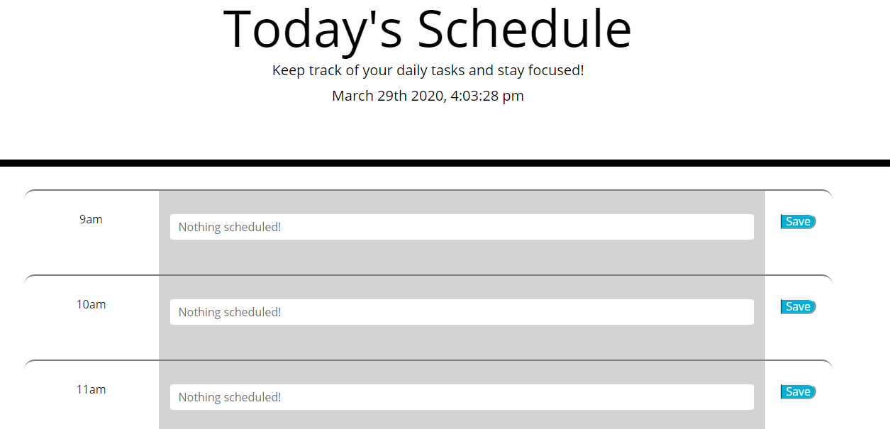

TODAY'S SCHEDULE --- an application for easily keeping track of your 9-5 tasks

1. Overview

Today's Schedule lets users plan out their day hour-to-hour. The top of the page displays the current date and time, and the rest of the page is primarily cut up into hourly timeblocks. Users may input their schedule into each hour slot. The application color codes each timeblock based on if it has passed, it is current, or is in the future. The application also saves tasks, so users may leave the page and come back.

2. Functionality

Today's Schedule runs using jQuery and moment.js, along with standard JavaScript. The script performs a check every second on the current time so it can precisely update the color coding when the hour changes. Each input form can be saved by clickigng the save input. This updates the relevant object in local storage to match the text value of the input form

3. Screenshots

4. Credits and Links

Made by Dan McKeon.

Active webpage: https://dooski.github.io/daily-planner/
GitHub repository: https://github.com/dooski/daily-planner
